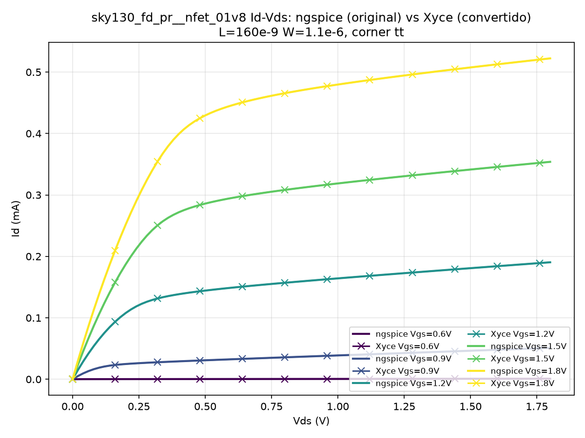
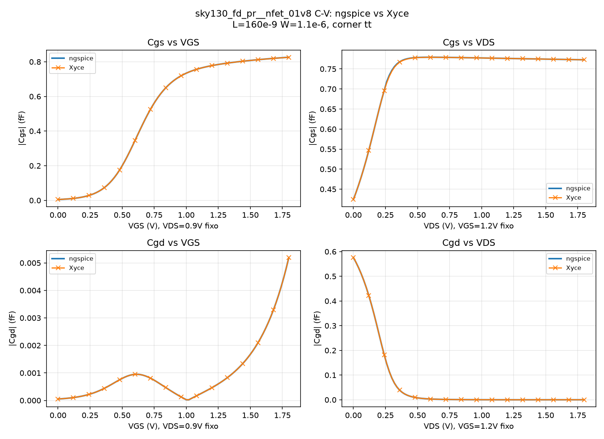
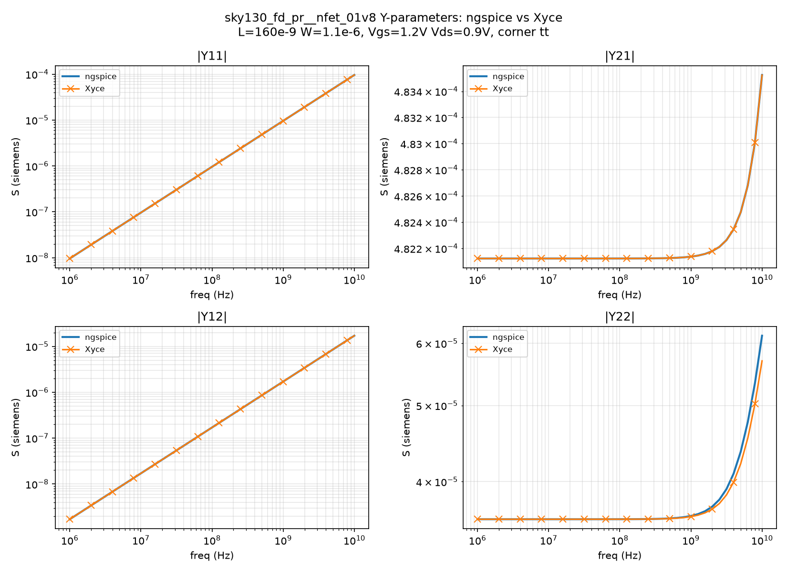
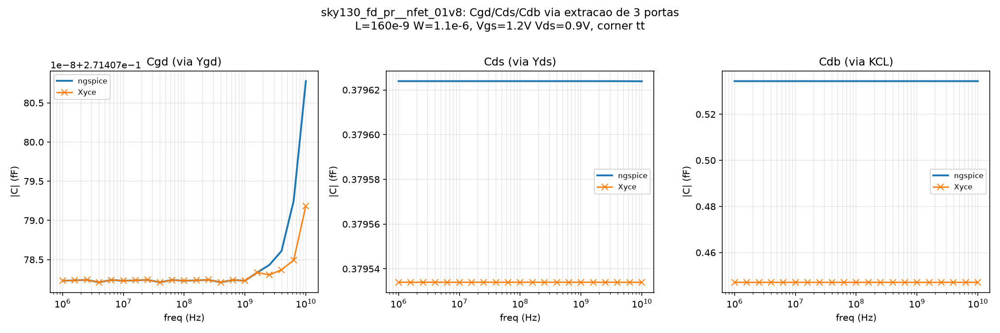
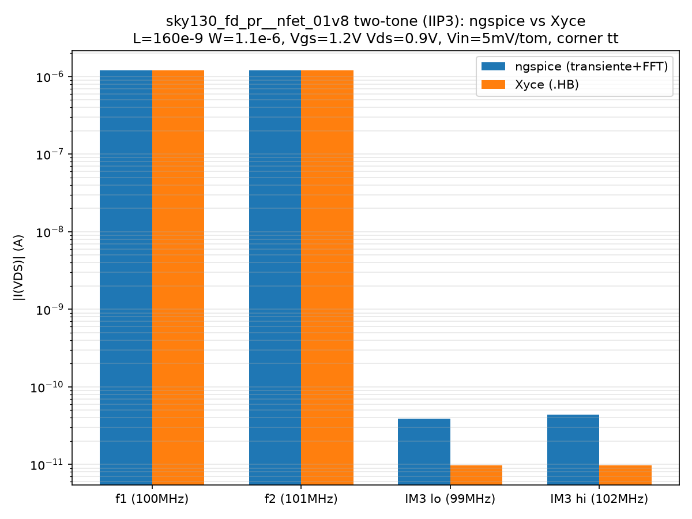

# sky130_xyce_convert

Conversor sky130_fd_pr (dialeto ngspice/hspice) -> Xyce, para viabilizar
simulacoes Harmonic Balance (mixer, PA, LNA, PLL). Foco atual: `nfet_01v8`
/ `pfet_01v8`; expansao planejada para dispositivos de tensao mais alta.

## Por que essa arquitetura

- **`patches/*.yaml`**: manifesto declarativo de incompatibilidades
  conhecidas (regex de/para + motivo + se ja foi confirmado no device
  atual). Patches sao dados, nao logica espalhada em if/else -- facilita
  auditoria e voce reaproveita/estende esse manifesto conforme descobre
  casos novos (esperado ao entrar nos dispositivos HV).
- **`converter/joiner.py`**: junta linhas de continuacao `+` em "linhas
  logicas" antes de aplicar regex. Suficiente para o formato do sky130 --
  nao tentamos um parser SPICE/AST completo (over-engineering para o
  problema).
- **`converter/patcher.py`**: aplica o manifesto sobre as linhas logicas.
- **`converter/scanner.py`**: checks estruturais de sanidade -- gate que
  deve falhar alto, nunca converter silenciosamente errado. Hoje cobre:
  contagem de `.model` cards, contagem de bins declarada no corner file,
  deteccao de `.model` de diodo `level=3`, e **deteccao de parametros
  referenciados em expressoes `{...}` sem `.param` correspondente no
  conjunto de arquivos processado** (ver achado abaixo).
- **`validate.py`**: stub da matriz de validacao ngspice-vs-Xyce (gm/gds,
  C-V, Y-parameters, IIP3 via HB, ruido). Os runners reais (subprocess
  para ngspice/Xyce) ficam para voce plugar na maquina Docker que ja tem
  o PDK instalado -- os formatos de saida (.raw do ngspice vs .prn do
  Xyce) sao diferentes o bastante para merecer parser dedicado por
  ferramenta, dependente de como o `run.py` atual estrutura testbenches.

## Achados confirmados nos arquivos reais (nfet_01v8, corner tt)

Rodando `converter.cli scan` nos dois arquivos do repositorio:

1. **Ruido esta parametrizado com valores reais**, nao defaults do BSIM4:
   `noia=2.5e+42`, `em=41000000.0`, `ntnoi=1.0`, `af=1.0`, `tnoia`,
   `tnoib`, `rnoia=0.94`, `rnoib=0.26` por bin. `noib`/`kf` vem zerados
   (termos desligados), o que e normal e nao indica ausencia de modelo.

2. **Divergencia real de contagem de bins**: `tt.corner.spice` declara
   `Number of bins: 63` (63 blocos `Bin NNN` com offsets `_diff_N`,
   N=0..62), mas `tt.pm3.spice` tem **180** `.model` cards
   (`.model.0` a `.model.179`). Os `_diff_N` do corner file **nao sao
   referenciados em nenhum lugar do pm3.spice** -- o mecanismo usado la
   e outro: mismatch estatistico via `AGAUSS(...)*MC_MM_SWITCH` sobre
   parametros `*_slope` (nao `*_diff_N`).

3. **Dependencia externa -- RESOLVIDA**: `sky130_fd_pr__nfet_01v8__toxe_slope`,
   `..._vth0_slope`, `..._voff_slope`, `..._vth0_slope1` sao referenciados
   dentro de expressoes do pm3.spice mas nao tinham `.param` definido nos
   dois arquivos originalmente inspecionados. Confirmado na arvore real do
   PDK (`$PDK_ROOT/$PDK/libs.ref/sky130_fd_pr/spice/`, container Docker):
   os 4 sao definidos em `sky130_fd_pr__nfet_01v8__mismatch.corner.spice`.
   O pipeline de `scan`/`convert` precisa incluir esse arquivo no conjunto
   processado (ja coberto pelo glob `sky130_fd_pr__nfet_01v8__*.spice`
   usado em `docker/sky130_xyce_convert/install.sh` no eda-env) -- sem
   isso, o Xyce reclama de parametro indefinido ao instanciar o device
   fora do contexto completo do PDK.

4. **Boas noticias**: nao foram encontrados neste arquivo especifico:
   token solto `vt`, token solto `temp`, comentario `$`, nem `.model` de
   diodo com `level=3`. Os patches correspondentes ficam no manifesto
   como rede de seguranca (`verified_in_nfet_01v8_tt: not_found`), pois
   sao esperados em outros arquivos do PDK (primitivos de diodo/resistor
   explicitos, ainda nao inspecionados).

5. **Novo achado (rodando `scan` contra todos os corners de nfet_01v8 de
   uma vez, via `docker/sky130_xyce_convert/install.sh` no eda-env)**:
   dezenas de parametros `*_diff_N` (`a0_diff_16`, `ags_diff_10`,
   `b0_diff_14`, `b1_diff_1`, `eta0_diff_1`, `k2_diff_10`, `keta_diff_10`,
   `nfactor_diff_55`, `rdsw_diff_16`, `u0_diff_2`, `ua_diff_53`, etc.)
   sao referenciados em expressoes dos `.pm3.spice` de corner mas nao tem
   `.param` definido em nenhum arquivo do conjunto `nfet_01v8*` staged
   pelo open_pdks. Mesmo padrao do achado 3 (`*_slope`): ou tem um arquivo
   comum ainda nao incluido no pipeline, ou cada corner so define o
   subconjunto de `_diff_N` relevante para o seu proprio range de bins
   (a contagem 63 vs 180 do achado 2 sugere isso). Nao bloqueia o build
   hoje (scan so falha em hard-fails), mas precisa ser resolvido antes de
   declarar a conversao de nfet_01v8 completa -- ver `known_external_dependencies`
   em `patches/nfet_01v8.yaml` para o mesmo mecanismo usado no achado 3.

6. **BUG CRITICO no `joiner.py` -- CORRIGIDO**: comentarios `* texto`
   intercalados DENTRO de blocos `.model` de varias linhas (ex.:
   `* Model Flag Parameters` seguido de linhas `+ lmin = ... lmax = ...`)
   eram tratados como inicio de uma nova linha logica, e absorviam as
   continuacoes `+` seguintes -- apagando silenciosamente `lmin/lmax/
   wmin/wmax/level/version/binunit` e todo o resto dos parametros BSIM4
   reais de **todo `.model` card do PDK** (esse padrao de comentario
   dentro de continuacao e onipresente no sky130_fd_pr). O `.model` card
   sobrevivia so com o nome, sem nenhum parametro eletrico. Descoberto
   rodando Xyce de verdade contra o netlist convertido (erro "no valid
   model card found" -- parecia incompatibilidade do Xyce, mas era
   corrupcao silenciosa nossa). Corrigido tratando linhas de comentario
   como transparentes a continuacao (ver `tests/test_joiner.py`).

7. **Incompatibilidade real Xyce confirmada -- patch aplicado**: mesmo
   com o `.model` correto, o Xyce rejeita a expressao de mismatch
   estatistico do sky130 (`toxe/vth0/voff = {BASE + MC_MM_SWITCH*
   AGAUSS(0,1.0,N)*(..._slope/sqrt(l*w*mult))}`) com o erro "Parameter
   TOXE ... contains unrecognized symbols" -- Xyce nao aceita `AGAUSS`
   referenciando geometria de instancia (`l`/`w`/`mult`) dentro de uma
   expressao de parametro `.model` (ngspice aceita). Como `MC_MM_SWITCH`
   e 0 em qualquer corner deterministico, o patch `strip_mc_mm_switch_mismatch_term`
   remove o termo aditivo inteiro (no-op numerico para simulacao nominal).
   **LIMITACAO CONHECIDA**: isso desliga mismatch estatistico (Monte
   Carlo) no lado Xyce para nfet_01v8 ate acharmos uma forma que o Xyce
   aceite (ou até o Xyce ganhar suporte a essa extensão).

8. **Divergencia real em Y22 (parte imaginaria) -- ISOLADA em Cdb via
   medicao independente de 3 portas, ABERTA, nao e bug do conversor**:
   validando `.AC` (ver secao abaixo), Y11/Y12/Y21 batem com erro <2e-4%
   em toda a faixa 1MHz-10GHz, mas a parte imaginaria de Y22 diverge de
   forma sistematica e **proporcional a frequencia** (razao ngspice/Xyce
   constante, nao e ruido).

   Primeira tentativa (subtrair `Cgd` do C-V de `Cdd_total=Im(Y22)/w`)
   apontou pra `Cdb`, mas isso e raciocinio por eliminacao -- nao prova
   nada sozinho, e o teste original tinha source e bulk no MESMO no
   (`XM1 d g 0 0 ...`), entao o "residual" podia ser `Cdb+Cds` misturados,
   nao `Cdb` puro. Pra fechar isso direito, medimos de verdade com 3
   portas (`XM1 d g s 0 ...`, source no seu proprio no, excitando gate/
   drain/source separadamente, bulk inferido por conservacao de carga
   via KCL sem precisar excita-lo): `Cgd` (via Ygd) e `Cds` (via Yds)
   batem **identicos** entre ngspice e Xyce quando medidos assim, cada
   um isoladamente -- so o residual em `Ydd` (que so pode vir de `Cdb`,
   ja que Cgd/Cds estao contabilizados) continua divergindo (~1.2x,
   mesma ordem de grandeza achada antes). Ou seja: nao e mais "o que
   sobra vira Cdb por definicao" -- agora Cgd e Cds foram medidos direto
   e batem; so `Cdb` diverge.

   Achado lateral (real, confirmado identico nos dois simuladores, nao
   e erro): `Cgd` via `Ygd` (excitando dreno) != `Cgd` via `Ydg`
   (excitando gate) -- ~2.15x de diferenca. Transcapacitancia
   quasi-estatica do BSIM4 e genuinamente nao-reciproca (propriedade
   conhecida de modelos de carga nao-linear); os dois simuladores
   concordam nesse valor, entao nao afeta a conclusao sobre Cdb.

   `Cdb` e exatamente a capacitancia que depende de `AD`/`PD` (a razao
   caiu de 1.2573x com `ad=pd=0` para 1.1237x com `AD`/`PD` explicitos,
   achado anterior) e que o Xyce nao deixa ler direto via variavel
   interna (achado 9). `Cgd`/`gds` (as partes que batem) sao as que
   efetivamente importam pra HB/mixer/PA (Y11/Y12/Y21); `Cdb` afeta
   impedancia de saida em RF (matching, Q de saida) onde o bulk/
   substrato entra na malha.

9. **Xyce nao expõe cgb/cbd/cbs/id via query de variavel interna do
   dispositivo -- limitacao de introspeccao, nao do modelo**: testando
   `.PRINT DC N(XM1:MSKY130_FD_PR__NFET_01V8:<param>)`, so `CGS`, `CGD`,
   `GM`, `GDS` e `VTH` respondem; `CGB`, `CBD`, `CBS`, `CDB`, `CSB`,
   `ID`, `IDS`, `GBD`, `GBS` dao erro "Function or variable ... is not
   [available]". ngspice expõe o conjunto completo
   (`@m.xm1.msky130_fd_pr__nfet_01v8[cgb]` etc. todos respondem). A
   fisica existe dos dois lados (Y22 no achado 8 prova isso); so nao da
   pra ler cgb/cbd/cbs direto do Xyce por esse caminho -- a extracao via
   `.AC` 3-porta (fonte tambem no source, ver achado 8) contorna isso
   indiretamente pra Cdb/Cds, mas Cgb continua sem medicao direta.

10. **Gotcha de metodologia no ngspice (nao e diferenca entre
    simuladores, mas quase gerou dado errado)**: ler
    `@m.xm1...[cgs]` dentro de um `.dc` sem um `.save` explicito
    ANTES do `.dc` retorna o MESMO valor (do ultimo ponto do sweep) em
    TODAS as linhas do `wrdata` -- sem erro, sem aviso. E preciso
    `.save v(g) v(d) @m.xm1...[cgs] @m.xm1...[cgd]` (incluindo os nos
    normais tambem, senao `.save` some com eles) antes do `.dc` pra
    ngspice de fato reamostrar por ponto. Descoberto comparando contra
    Xyce: o valor "congelado" reportado pelo ngspice em toda a curva
    batia com o valor real do Xyce so no ULTIMO ponto do sweep (Vgs ou
    Vds = 1.8V) -- sinal de que o ngspice so tinha capturado o cgs/cgd
    do ponto final da analise, nao um valor por ponto.

11. **Gotcha de metodologia no Xyce (idem, quase gerou dado errado)**:
    `.PRINT AC ... IR(VGS) II(VGS) ...` sempre antepõe uma coluna `FREQ`
    no CSV de saida, mesmo sem pedir -- ao contrario do `.PRINT DC`, que
    so imprime exatamente o que foi listado. Um script de parsing que
    assume "coluna 0 = primeiro item pedido" (em vez de "coluna 0 =
    FREQ") fica com tudo deslocado em 1 posicao e produz numeros sem
    sentido fisico (capacitancias em escala 1e-11 em vez de 1e-16).
    Descoberto comparando os dados BRUTOS de ngspice e Xyce lado a lado
    -- batiam perfeitamente uma vez alinhados corretamente.

12. **Sintaxe do `.HB` do Xyce (nao documentada em lugar obvio, achada
    por tentativa/erro guiado pelas mensagens de erro)**: `.HB
    FREQ=f1,f2` e `.HB TONES=f1,f2` **nao** funcionam ("Attempt to
    assign value for FREQ from ..."). A forma que funciona e
    posicional, frequencias separadas por ESPACO (nao virgula):
    `.HB f1 f2`. `NUMFREQ=` e opcional (usa default se omitido). Saida
    no dominio da frequencia via `.PRINT HB_FD FORMAT=csv ... I(dev)`
    -- da Re/Im direto por frequencia, sem precisar de FFT.

13. **IIP3 (two-tone): ngspice transiente+FFT converge na direcao certa
    mas nao fecha com Xyce `.HB` -- ABERTO, nao bloqueante**. f1=100MHz,
    f2=101MHz, 5mV/tom, Vgs=1.2V/Vds=0.9V. As fundamentais (f1, f2)
    batem quase exato entre os dois metodos (`1.2050e-06` ngspice vs
    `1.2053e-06` Xyce), mas o IM3 (2f1-f2, 2f2-f1) -- ~100dB abaixo da
    fundamental -- e onde a coisa complica:
    - Gotcha 1 (ngspice): `.tran` sem `linearize` antes do `wrdata`
      grava os passos ADAPTATIVOS internos (nao uniformes) -- quebra
      qualquer FFT. Precisa de `linearize i(VDS)` antes.
    - Gotcha 2 (ngspice): com numero IMPAR de amostras (contando os
      dois extremos do `.tran`), nenhuma das 4 frequencias de interesse
      cai exatamente num bin da FFT -- vazamento espectral mesmo sem
      janela (Hanning so piora, espalhando ainda mais a fundamental
      enorme pros bins vizinhos onde o IM3 minusculo mora). Descartar a
      ultima amostra (numero PAR) resolve, dado que f1/f2/IM3 sao todos
      multiplos exatos de 1MHz e a janela e 20us.
    - Com esses dois fixes e `reltol` default, o IM3 do ngspice ainda
      saia ~70-100x maior que o do Xyce (assimetrico entre os dois
      lados tambem, 2f1-f2 vs 2f2-f1). Bem provavel: ruido numerico do
      solver de transiente, ja que IM3 esta ~100dB abaixo da fundamental
      -- perto ou abaixo do chao de precisao do `reltol`/`abstol` default.
      Apertando pra `reltol=1e-10` (`vntol=1e-18 abstol=1e-21`), o gap
      cai pra ~4x (`3.9e-11`/`4.4e-11` ngspice vs `9.7e-12` Xyce nos
      dois lados) e fica bem mais simetrico. `reltol=1e-11` ou mais
      apertado **quebra** a simulacao (poucas centenas/milhares de
      pontos em vez de dezenas de milhares -- o solver falha, nao
      converge melhor).
    - Resultado final: `Vin_IIP3` ngspice=853mV vs Xyce=1761mV (razao
      0.48, ~2x). Acima da tolerancia de 10% que `validate.py` propõe,
      mas esse caso ja e nao-bloqueante ali -- e um teste conhecido
      como dificil (por isso o proprio Xyce tem `.HB` dedicado: metodo
      de transiente+FFT tem dificuldade real pra resolver sinais dezenas
      de dB abaixo da fundamental sem apertar tolerancia ao ponto de
      instabilidade numerica). Nao indica divergencia de modelo -- as
      fundamentais batem quase exato, e a nao-linearidade de Id(Vgs,Vds)
      que gera IM3 ja foi validada no teste DC.

## Validacao: Id-Vds nfet_01v8, ngspice (original) vs Xyce (convertido)

`validate/nfet_01v8_idvds/compare.py` instancia um `sky130_fd_pr__nfet_01v8`
(L=160nm, W=1.1um, corner `tt`) em ambos os simuladores -- ngspice contra
o netlist original do PDK, Xyce contra a saida de `converter.cli convert`
-- varre Vds 0..1.8V para 5 valores de Vgs e compara Id ponto a ponto.



Erro relativo maximo observado (todos os Vgs, Vds > 0.05V): **~1e-6 %**
-- ruido de ponto flutuante entre os dois simuladores, nao divergencia
de modelo. As curvas ngspice (linha) e Xyce (marcador `x`) sao
visualmente identicas.

| Vgs (V) | erro max (%) | erro medio (%) |
| ------- | ------------ | -------------- |
| 0.6     | 6.7e-07      | 3.7e-07        |
| 0.9     | 5.3e-07      | 2.1e-07        |
| 1.2     | 9.9e-07      | 1.3e-07        |
| 1.5     | 5.4e-07      | 1.0e-07        |
| 1.8     | 6.1e-07      | 1.2e-07        |

Reproduzir (dentro de um ambiente com ngspice, Xyce e o PDK sky130
instalados -- ver `docker/sky130_xyce_convert` no repo `eda-env`):

```bash
python3 validate/nfet_01v8_idvds/compare.py \
    --pdk-root /usr/local/share/pdk --pdk sky130A
```

Este resultado só cobre gm/gds em DC (achado 1 da matriz de
`validate.py`); C-V, Y-parameters e IIP3 via HB ainda sao TODO.

## Validacao: C-V nfet_01v8, ngspice vs Xyce

`validate/nfet_01v8_cv/compare.py` le `Cgs`/`Cgd` direto dos parametros
internos do BSIM4 (sem precisar de `.AC`) via `.DC` + query de variavel
interna do dispositivo, varrendo Vgs (Vds=0.9V fixo) e Vds (Vgs=1.2V
fixo) 0..1.8V. Cobertura parcial por escolha: `Cgb`/`Cdb`/`Csb` ficam de
fora porque o Xyce nao expõe essas 3 pelo mesmo caminho (achado 9).



| curva      | erro max (%) |
| ---------- | ------------ |
| Cgs vs Vgs | 3.7e-02      |
| Cgd vs Vgs | 3.4e-06      |
| Cgs vs Vds | 4.1e-01      |
| Cgd vs Vds | 1.3e-05      |

Curvas classicas de C-V de MOSFET (sigmoide de `Cgs` no turn-on, vale de
`Cgd` no pinch-off `Vgs=Vds+Vov`, rolloff de Miller de `Cgd` vs Vds) --
ngspice e Xyce essencialmente sobrepostos, erro maximo <0.5% (`Cgs` vs
Vds, provavelmente onde a curva tem a maior derivada/mais sensivel a
diferenças de passo de sweep entre os dois simuladores).

Reproduzir:

```bash
python3 validate/nfet_01v8_cv/compare.py \
    --pdk-root /usr/local/share/pdk --pdk sky130A
```

## Validacao: Y-parameters nfet_01v8, ngspice vs Xyce (.AC)

`validate/nfet_01v8_yparams/compare.py` extrai Y11/Y12/Y21/Y22 via duas
excitacoes `.AC` (2-porta: porta 1 = gate, porta 2 = drain; a fonte de
tensao ideal na porta nao excitada funciona como curto AC), varrendo
1MHz-10GHz no ponto de polarizacao Vgs=1.2V/Vds=0.9V (mesmo device do
teste Id-Vds).



| parametro | erro max (%) |
| --------- | ------------ |
| Y11       | 2.1e-07      |
| Y21       | 1.8e-04      |
| Y12       | 1.6e-05      |
| Y22       | 7.1          |

Y11 (admitancia de entrada / Cgg), Y21 (transcondutancia direta) e Y12
(transferencia reversa / Cgd) batem tao bem quanto o teste DC. **Y22
diverge visivelmente acima de ~1GHz** -- ver achado 8 acima; e uma
divergencia real de capacitancia de saida entre os dois simuladores,
nao um artefato do conversor (gds, a parte real, bate perfeitamente).

Reproduzir:

```bash
python3 validate/nfet_01v8_yparams/compare.py \
    --pdk-root /usr/local/share/pdk --pdk sky130A
```

### Decomposicao de Y22: Cgd/Cds/Cdb via 3 portas

`validate/nfet_01v8_yparams/cdb_3port_check.py` e a medicao independente
citada no achado 8 -- source no seu proprio no (nao mais amarrado ao
bulk), 3 excitacoes separadas (gate/drain/source), varrendo a mesma
faixa 1MHz-10GHz.



| capacitancia   | erro max (%) |
| -------------- | ------------ |
| Cgd (via Ygd)  | 5.9e-06      |
| Cds (via Yds)  | 2.4e-02      |
| Cdb (via KCL)  | 16.3         |

`Cgd` e `Cds` ficam essencialmente flat e sobrepostos em toda a faixa
(a curva de `Cgd` sobe visivelmente >1GHz nos dois simuladores por
igual -- o modelo quasi-estatico comecando a mostrar seus limites, nao
diferenca entre eles). `Cdb` tem um gap constante e nitido (~16%) do
inicio ao fim -- confirma visualmente o que o achado 8 descreve: a
divergencia inteira de Y22 mora ali.

Reproduzir:

```bash
python3 validate/nfet_01v8_yparams/cdb_3port_check.py \
    --pdk-root /usr/local/share/pdk --pdk sky130A
```

## Validacao: IIP3 (two-tone) nfet_01v8, ngspice vs Xyce

`validate/nfet_01v8_iip3/compare.py` -- os dois metodos que `validate.py`
ja previa (".HB (Xyce) vs transiente+FFT (ngspice)"). f1=100MHz,
f2=101MHz, 5mV/tom, Vgs=1.2V/Vds=0.9V (mesmo device dos outros testes).



|                 | ngspice     | Xyce        |
| --------------- | ----------- | ----------- |
| f1 (100MHz)     | 1.2050e-06  | 1.2053e-06  |
| f2 (101MHz)     | 1.2050e-06  | 1.2053e-06  |
| IM3 lo (99MHz)  | 3.8650e-11  | 9.7135e-12  |
| IM3 hi (102MHz) | 4.4160e-11  | 9.7135e-12  |

`Vin_IIP3`: ngspice=853mV, Xyce=1761mV (razao 0.48). Fundamentais batem
quase exato; IM3 ainda diverge ~4x mesmo depois dos fixes de
metodologia (achado 13) -- **aberto, nao bloqueante**, resultado de
limitacao pratica do metodo transiente+FFT pra sinais ~100dB abaixo da
fundamental, nao de divergencia de modelo entre os simuladores.

Reproduzir:

```bash
python3 validate/nfet_01v8_iip3/compare.py \
    --pdk-root /usr/local/share/pdk --pdk sky130A
```

## Uso

```bash
# so diagnostico, nao escreve nada
python3 -m converter.cli scan \
    --input "path/para/sky130_fd_pr__nfet_01v8__tt.pm3.spice" \
            "path/para/sky130_fd_pr__nfet_01v8__tt.corner.spice" \
    --patches patches/nfet_01v8.yaml

# aplica patches e escreve netlists convertidos
python3 -m converter.cli convert \
    --input "path/para/*.spice" \
    --patches patches/nfet_01v8.yaml \
    --outdir build/xyce/nfet_01v8
```

## Proximos passos sugeridos

1. ~~Rodar `scan` contra a arvore completa do sky130_fd_pr...~~ RESOLVIDO --
   ver achado 3 acima (`mismatch.corner.spice`).
2. Confirmar a divergencia 63 vs 180 -- pode ser esperado (bins mais
   finos no lado eletrico do que no lado de corner-offset) ou pode
   indicar que faltam blocos `_diff_N` de 63 a 179 em algum outro
   arquivo. Se confirmado como esperado, adicionar `expected_counts` no
   `cmd_convert`/CI para travar a contagem futura.
3. Estender `patches/` para os dispositivos HV -- bons candidatos a
   trazer parametros dependentes de `sa`/`sb`/drift region que podem
   tocar as expressoes "dinamicas" que o Xyce rejeita (ver conversa
   sobre resistores dependentes de tensao).
4. Os 3 casos bloqueantes da matriz em `validate.py` (gm/gds DC, C-V,
   Y-parameters) tem runners reais e resultados publicados -- ver as
   secoes "Validacao" acima (`validate/nfet_01v8_idvds/`,
   `validate/nfet_01v8_cv/`, `validate/nfet_01v8_yparams/`). IIP3
   (nao-bloqueante) tambem tem runner (`validate/nfet_01v8_iip3/`), mas
   com gap de ~4x em aberto (achado 13) -- so falta `.NOISE`
   (nao-bloqueante) pra matriz inteira ter pelo menos uma tentativa
   real. Vale integrar esses scripts (ou o padrao deles) de volta em
   `validate.py`/`run_case` quando fizer sentido consolidar -- hoje sao
   caminhos separados por dispositivo/analise.
5. ~~Integrar como estagio de build no Dockerfile~~ FEITO -- ver
   `docker/sky130_xyce_convert/install.sh` e o stage `xyce-pdk-convert`
   no `Dockerfile` do repo `eda-env` (`FROM pdk-stage`, escopo restrito
   a `nfet_01v8` por enquanto, `scan` bloqueia o build so em hard-fails
   -- diodo level=3 / mismatch de contagem de bins -- nao nos achados
   ainda em aberto). Esse repo e consumido via `git clone` + `checkout`
   pinado por `SKY130_XYCE_CONVERT_VERSION` (build-arg), mesmo padrao
   usado para magic/xschem/pdk. Publicado em
   `github.com/moduhub/sky130_xyce_convert`.
6. Avaliar propor isso como flag/hook no `open_pdks`
   (`--enable-xyce-sky130`), no mesmo padrao de magic/xschem/netgen,
   em vez de tentar mergear netlists convertidas no `sky130_fd_pr`
   canonico (repo de fonte de foundry, resistente a edits
   format-specific). Depende de validar a conversao em producao
   primeiro (item 4).
